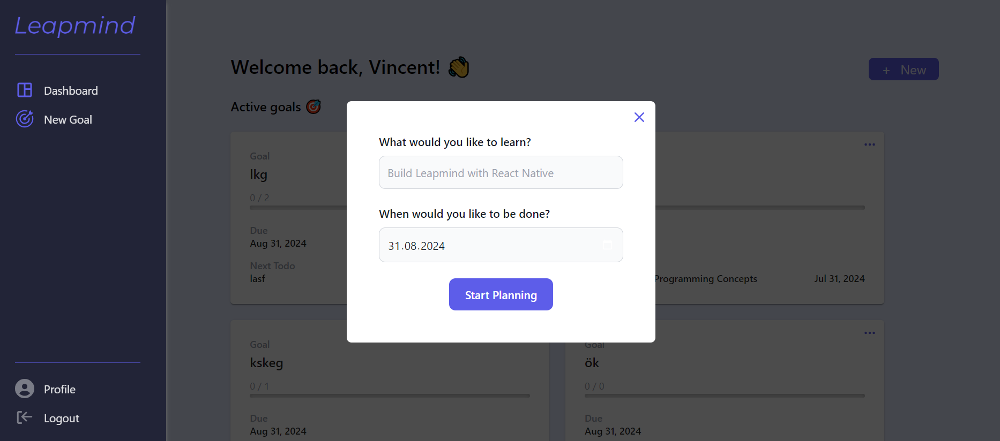
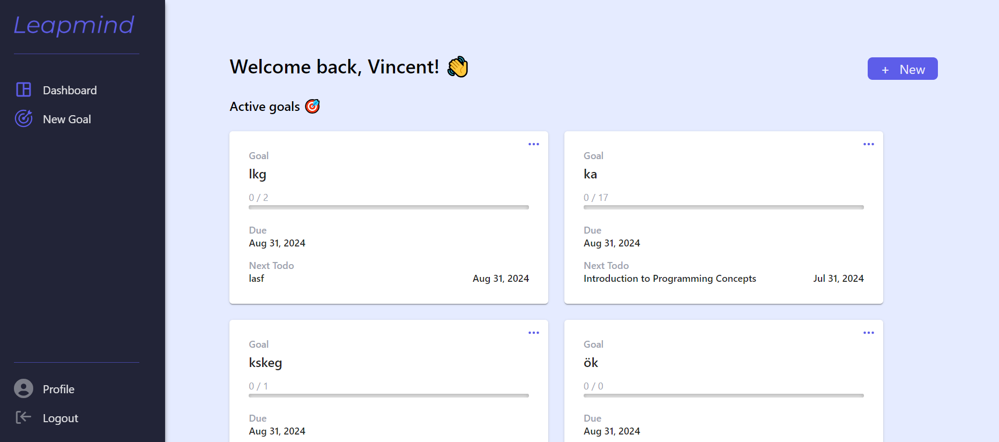
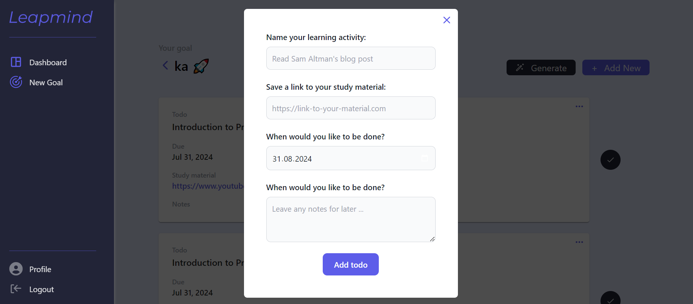
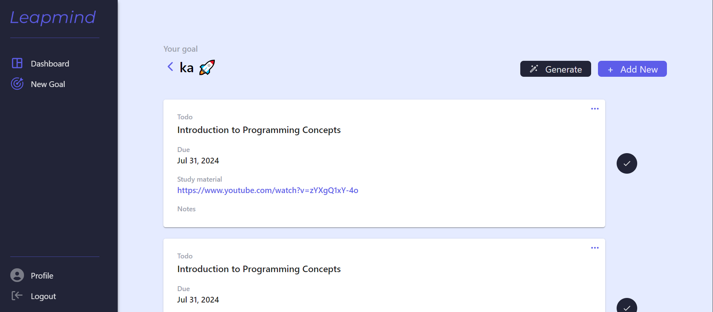
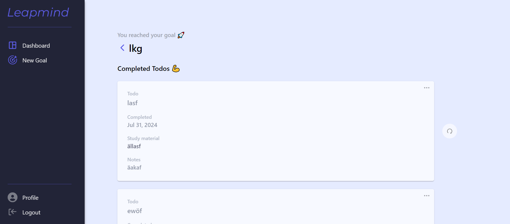
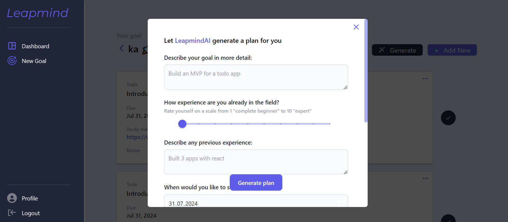

# Leapmind

Leap mind is a digital tool to manage your learning ambitions. Add learning goals and tasks/todos to your goals to keep track of all things you want to study further to come closer to your goal. Leapmind also helps you get started learning things you don't know how to start. Simply add a goal and let Leapmind AI generate learning activities for you based on your preferences.

## How it works

- **Add goals**: 
  
  - Click the "add" button to open a form
  
  - Enter a goal title and timeline to achieve your goal
    
    

- **Track your goals**: 
  
  - Keep an overview of all goals you created and their main information in your dashboard
  
  - Each goal will keep track of its todos and their overall progress
    
    

- **Track goal todos**: 
  
  - Click on a goal card to open its todos

- **Add todos to goals**: 
  
  - On a goal's page, add a todo by click on the "new" button
  
  - Enter a description along with a timeline for completion, links to resources and potential notes.
    
    

- **Manage todos**: 
  
  - "Tick off" todos that you completed. 
  
  - Completed todos will appear on the bottom.
  
  - You can undo completion by clicking on the recycle button next to it. 
  
  - Once all todos are done, the goal is completed
    
    
    
    

- **Generate todos with AI**
  
  - On a goal's page, click the "generate" button
  
  - In the form, fill in the details and submit
  
  - The todo list of your goal with load once the AI model populated your todos
    
    

## How to install and make it run locally:

1. Fork this repo into your GitHub

2. Clone your fork onto your local machine using
   
   1. If you wish to load the project into a new directory, create one first
   
   2. In your terminal navigate into your desired directory for this project
   
   3. Inside the directory, load your forked repository to you local machine using `git clone <link_to_your_forked_repo>`

3. Install dependencies
   
   1. Navigate in your terminal into the `/server` directory and use `npm i`to install dependencies
   
   2. Navigate in your terminal into the `/client` directory and use `npm i`to install dependencies

4. Setup environment variables
   
   1. Add API key for Gemini
      
      - Create a `.env` file in the `/server` directory
      
      - Add a environment variable `GEMINI_API_KEY`
      
      - Get your api key from Gemini following their setup guide [Gemini Docs](https://ai.google.dev/gemini-api/docs/api-key)
      
      - Assign your api key to your variable `GEMINI_API_KEY='your-api-key'`
   
   2. Add your database connection variables
      
      - Setup your PostgreSQL database (local or cloud) following the start guide of your provider
      
      - Add environment variables `DB_USERNAME`, `DB_PASSWORD` and optionally if you prefer different settings: `DB_PORT`, `DB_HOST`. Assign each variable the corresponding details for your version and connection of database

5. Start the app
   
   1. Start your backend: In your terminal, navigate to the `/server` directory and run `node index.js` (or use nodemon instead of node if you have installed).
      
      **NOTE**: You should see messages logged to your console confirming your connection to the database and your server
   
   2. Start your frontend: In another terminal window, navigate to the `/client` directory and run `npm run dev`
      
      **NOTE**: Your editor should prompt you to open the app in the browser or simply enter `http://localhost:<your_port>` into the browser. You should see the app now.

## Tech Stack

- Frontend (written in TypeScript)
  
  1. React with vite
  
  2. Tailwind css for styling
  
  3. Material UI for some components
  
  4. React-icons for icons

- Backend (written in JavaScript)
  
  1. Koa server
  
  2. PostgreSQL
  
  3. Sequielize as the orm for Postgres
  
  4. Gemini AI
