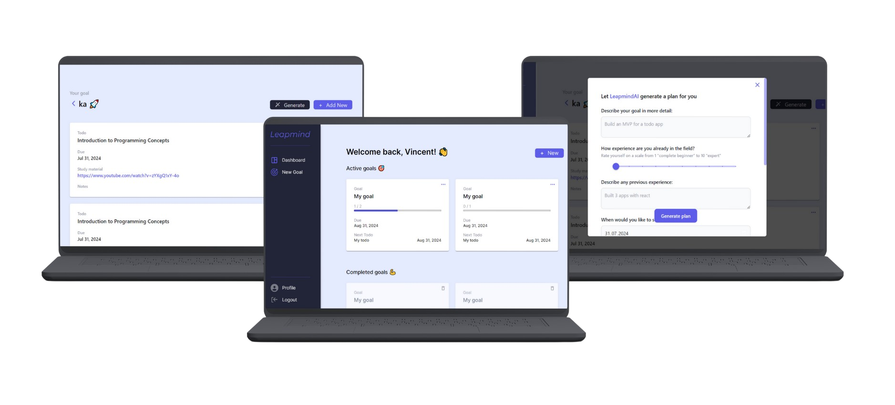
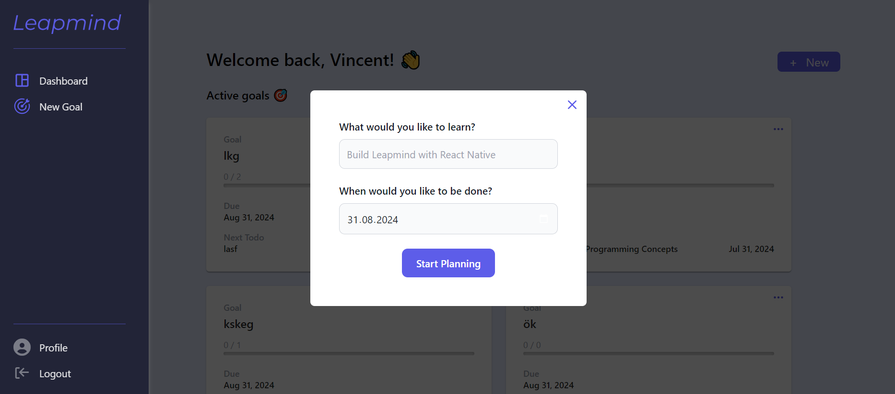
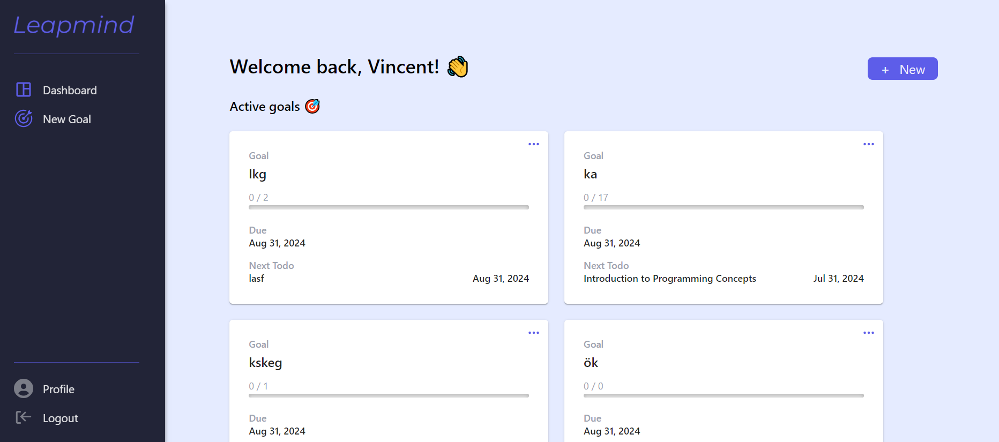
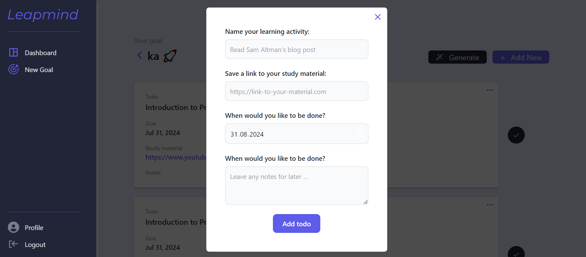
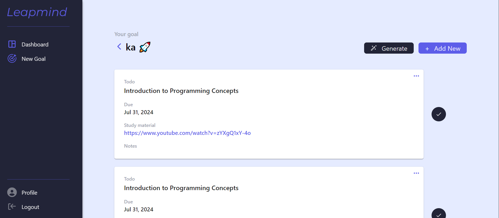
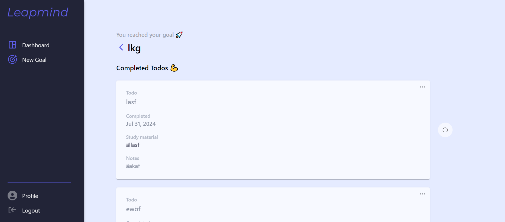
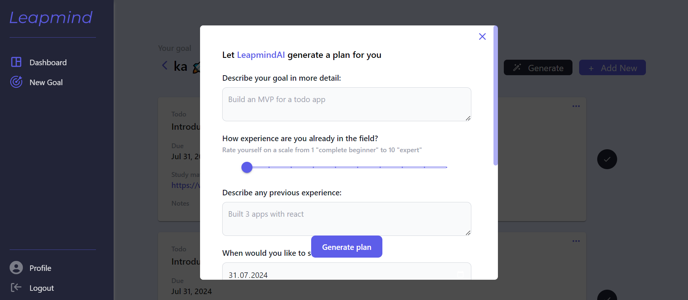

<h1 align="center">
  
</h1>

Leapmind is a web- and AI-based todo app for personal learning plans. It allows you to plan your personal learning journey with the help of AI as well as manage and track goal-related learning activities. 


## The app
<p align="center">
  
</p>


## Getting started

1. Regularls: Make sure you have installed on your local machine `nodeJs` `v22.3+` as a runtime environment, the package manager `npm` and `git`.

2. Database: Install and set up [postgreSQL](https://www.postgresql.org/download/) as your database on your local machine or any other database of your choice that is compatible with [Sequelize](https://sequelize.org/)

3. Google Api: Login into our Google Developer account or set one up and get your api key from Gemini following their setup guide [Gemini Docs](https://ai.google.dev/gemini-api/docs/api-key)


## Install and run the app:

1. Fork this repo into your GitHub

2. Clone your fork onto your local machine using
   
   1. If you wish to load the project into a new directory, create one first
   
   2. In your terminal navigate into your desired directory for this project and load your forked repository to you local machine
      ```bash
      cd <your-directory-name>
      git clone <link_to_your_forked_repo>`
      ```

3. Install dependencies
   
   1. Navigate in your terminal into the `/server` directory and install dependencies from npm
      ```bash
      cd server
      npm i
      cd ..         # ! navigates back to root directory !
      ```
   
   2. Navigate in your terminal into the `/client` directory and install dependencies from npm
      ```bash
      cd client   
      npm i
      cd ..          # ! navigates back to root directory !
      ```

4. Setup environment variables
   1. Via your terminal, create a `.env` file in the `/server` directory
      ```bash
      cd server
      touch .env
      cd ..          # ! navigates back to root directory !
      ```

   2. Add API key for Gemini via the terminal
      ```bash
      echo "GEMINI_API_KEY='your_api_key'" >> .env      # ! replace 'your_api_key' with your key created for Gemini in the Google AI Studio !
      ```
   
   3. Add your database connection variables via the terminal
      
      - Add environment variables `DB_USERNAME`, `DB_PASSWORD` and optionally if you prefer different settings: `DB_PORT`, `DB_HOST`
        
      - Assign each variable the corresponding details for your version and connection of database
     
      ```bash
      # ! Replace the placeholders with your actual postgres username, password, host, and port. !
      echo "DB_USERNAME='your_username'" >> .env
      echo "DB_PASSWORD='your_password'" >> .env
      echo "DB_HOST='your_host'" >> .env
      echo "DB_PORT='your_port'" >> .env
       ```
     
    4. Optional: Customize your server & client port
      ```bash
      # ! Replace the placeholders with your actual ports !
      echo "SERVER_PORT='your_port'" >> .env
      echo "CLIENT_PORT='your_port'" >> .env
      ```

6. Start the app
   
   1. Start your backend: 
      ```bash
      cd server   
      node index.js    # ! you can use nodemon instead of node if you have it installed !
      cd ..            # ! navigates back to root directory !
      ```
      
      **NOTE**: You should see messages logged to your console confirming your connection to the database and your server
   
   3. Start your frontend: Open a new terminal window and run the following code from your current directory (`/server`)
      ```bash
      cd ..            # ! navigates back to root directory !
      cd client
      npm run dev
      ```
      
      **NOTE**: Your editor should prompt you to open the app in the browser or simply enter `http://localhost:<your_port>` into the browser. You should see the app now.


## How it works

- **Add goals**: 
  
  - Click the "add" button to open a form
  
  - Enter a goal title and timeline to achieve your goal
    
    

- **Track your goals**: 
  
  - Keep an overview of all goals you created and their main information in your dashboard
  
  - Each goal will keep track of its todos and their overall progress
    
    

- **Track goal todos**: 
  
  - Click on a goal card to open its todos

- **Add todos to goals**: 
  
  - On a goal's page, add a todo by click on the "new" button
  
  - Enter a description along with a timeline for completion, links to resources and potential notes.
    
    

- **Manage todos**: 
  
  - "Tick off" todos that you completed. 
  
  - Completed todos will appear on the bottom.
  
  - You can undo completion by clicking on the recycle button next to it. 
  
  - Once all todos are done, the goal is completed
    
    
    
    

- **Generate todos with AI**
  
  - On a goal's page, click the "generate" button
  
  - In the form, fill in the details and submit
  
  - The todo list of your goal with load once the AI model populated your todos
    
    


## Tech Stack

- Frontend (in TypeScript)
  
  1. React + vite
  
  2. Tailwind css & vanilla css: styling
  
  3. Material UI: form components
  
  4. React-icons: icons

- Backend (in JavaScript)
  
  1. Koa server (incl. koa router, bodyparser & cors)
  
  2. PostgreSQL
  
  3. Sequelize (postgres orm)
  
  4. Gemini AI (Google)
